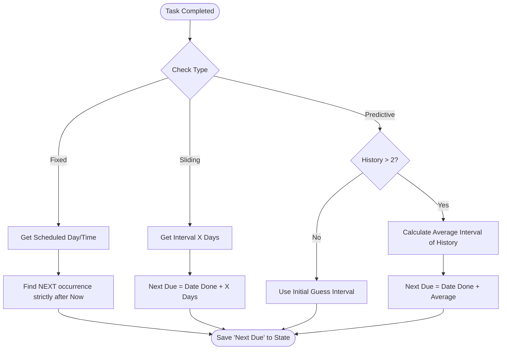

# Task Tracker
A smart custom integration for Home Assistant to track recurring chores, maintenance tasks, and personal habits.
Unlike standard calendar events, **Task Tracker** calculates due dates based on when you *actually* completed the task, offering "sliding" intervals, strict schedules, and AI-lite predictive scheduling.
## ✨ Features
 * **Three Smart Logic Modes:**
   * 🗓️ **Fixed:** Strict schedule (e.g., "Every Sunday at 9 PM"). If you miss it, it stays overdue.
   * 🔄 **Sliding:** Resets the timer *after* completion (e.g., "Change HVAC filter 90 days after I last did it").
   * 🔮 **Predictive:** Learns from your habits. Averages your last 10 completions to predict the next due date.
 * **Rich Metadata:**
   * **Assignees:** Link tasks to real Home Assistant Users/Persons.
   * **Tags:** Organize with tags like health, chore, or garden.
 * **Audit History:** Keeps a persistent log of the last 10 completion timestamps.
 * **Snoozing:** Temporarily mute notifications or overdue status for a specific task without resetting its schedule.
 * **Time Travel:** Support for backdating tasks (e.g., "I did this yesterday") via service calls.
 * **Fully UI Configurable:** Add, Edit, and Manage tasks directly from Settings. **No YAML required.**
## 🧠 Logic Flow

## 📂 Installation
### Method 1: HACS (Recommended)
 * Open HACS > Integrations.
 * Click the 3 dots (top right) > Custom Repositories.
 * Add the URL to this repository and select Integration.
 * Click Download.
 * Restart Home Assistant.
### Method 2: Manual Installation
 * Download this repository.
 * Copy the task_tracker folder into your Home Assistant /config/custom_components/ directory.
 * Restart Home Assistant.
## ⚙️ Configuration
> Note: This integration does not use YAML configuration.
> 
 * Go to Settings > Devices & Services.
 * Click + Add Integration.
 * Search for Task Tracker.
 * Step 1: Enter the Task Name and select the Logic Type.
 * Step 2: Configure the details:
   * Interval/Schedule: Set days, times, or intervals based on the type.
   * Icon: Use the visual picker to find the perfect icon.
   * Assignees: Select household members (linked to HA Person entities).
   * Tags: Select existing tags or type a new one to create it.
## Editing Tasks
To change a schedule or rename a task, simply click the Configure button on the integration entry list. Changes apply immediately.
## 🛠️ Services
### task_tracker.complete_task
Marks a task as done.
 * Arguments: last_done (Optional): Specify a date/time in the past if you forgot to log it earlier.
<!-- end list -->
```yaml
action: task_tracker.complete_task
target:
  entity_id: sensor.change_hvac_filter
data:
  last_done: "2023-10-25 14:00:00"

```
### task_tracker.snooze_task
Temporarily changes the task status to Snoozed until a set date, adding a snoozed_until attribute. This doesn't affect the core next_due calculation! Great for blocking notification triggers.
```yaml
action: task_tracker.snooze_task
target:
  entity_id: sensor.take_out_trash
data:
  until: "2023-10-28 10:00:00"

```
### task_tracker.unsnooze_task
Wipes a previously set snooze early.
```yaml
action: task_tracker.unsnooze_task
target:
  entity_id: sensor.take_out_trash

```
### task_tracker.reset_history
Wipes the audit log and resets the "Last Done" date. Useful if you made a mistake or want to restart the Predictive logic learning.
```yaml
action: task_tracker.reset_history
target:
  entity_id: sensor.cut_nails

```
## 📱 Dashboard Examples
 1. The "Mark Done" Button (Tile Card)
   The cleanest way to interact with tasks.
<!-- end list -->
```yaml
type: tile
entity: sensor.take_out_trash
name: Take Out Trash
features:
  - type: button
    name: Mark Done
    icon: mdi:check
    tap_action:
      action: perform-action
      perform_action: task_tracker.complete_task
      target:
        entity_id: sensor.take_out_trash

```
 2. "My Tasks" List (Auto-Entities)
   Automatically shows tasks assigned to the current user. Requires Auto-Entities from HACS.
<!-- end list -->
```yaml
type: custom:auto-entities
card:
  type: entities
  title: 👤 My Tasks
filter:
  include:
    - domain: sensor
      integration: task_tracker
      attributes:
        assignees: "Me"  # Matches the Friendly Name of your user
      options:
        secondary_info: last-updated

```
 3. Automating Notifications using Snooze
   Use templates in your automations to ignore snoozed tasks!
<!-- end list -->
```yaml
alias: "Notify Overdue Tasks"
trigger:
  - platform: time
    at: "09:00:00"
condition:
  - condition: template
    value_template: >
      {{ states('sensor.take_out_trash') == 'Overdue' and state_attr('sensor.take_out_trash', 'snoozed_until') == none }}
action:
  - service: notify.notify
    data:
      message: "Please take out the trash!"

```
